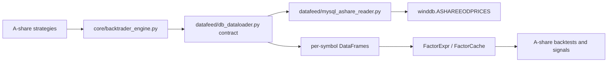

# refactor: Remove ETF/PostgreSQL data modules and read A-share prices from MySQL

## Overview

This plan removes ETF-specific execution paths and PostgreSQL-backed market-data modules, then makes A-share daily price loading read from the Wind MySQL table described in `update.md`. The goal is an A-share-only system whose backtest and signal pipeline no longer depends on ETF code paths, AKShare market-data downloads, or local PostgreSQL price caches.

## Problem Frame

The current architecture is PostgreSQL-first for both historical market data and application persistence. `datafeed/db_dataloader.py` reads ETF and stock history through `database/pg_manager.py`; when data is missing it can download from AKShare and write back to PostgreSQL. ETF support is spread across runners, strategies, filters, database models, Web endpoints, and docs. The requested target is narrower: remove ETF-related modules, remove PostgreSQL-related modules, and read A-share trading data from MySQL using `ASHAREEODPRICES` fields in `update.md`.

## Requirements Trace

- R1. Delete ETF-related modules and references from runnable entry points, data loaders, strategy discovery, Web/API surfaces, and documentation.
- R2. Delete PostgreSQL-specific modules and dependencies instead of keeping a PostgreSQL market-data cache behind the A-share pipeline.
- R3. Replace A-share daily price reads with MySQL reads from `ASHAREEODPRICES` using the query shape in `update.md`.
- R4. Preserve A-share strategy/backtest/signal behavior where possible: strategies still receive DataFrames with `date`, `symbol`, `open`, `high`, `low`, `close`, `volume`, and related price columns expected by factor/backtest code.
- R5. Avoid hardcoding database credentials from `update.md`; move connection settings to environment/configuration and treat `update.md` as schema/query reference only.

## Scope Boundaries

- This plan does not migrate ETF historical data or ETF signals; ETF paths are removed.
- This plan does not define a new persistence schema for non-price artifacts unless implementation confirms existing signal/backtest persistence must survive PostgreSQL removal.
- This plan does not change A-share strategy formulas, A-share commission rules, T+1 constraints, or short-term stock-selection business logic.
- This plan does not require live MySQL connectivity during planning; implementation should verify runtime access separately.

### Deferred to Separate Tasks

- Historical cleanup of already-created PostgreSQL tables/data: handle outside this code refactor if the database still exists in an environment.
- Replacing AKShare-based sector/fundamental data sources: this plan focuses on A-share daily price reads. Sector/fundamental modules are noted as integration risks because they still use AKShare/PostgreSQL-oriented models.

## Context & Research

### Relevant Code and Patterns

- `skills/aitrader-framework/references/architecture.md` defines the current main chain as data acquisition -> PostgreSQL -> `DbDataLoader` -> `FactorExpr` -> `Engine` -> backtest result.
- `datafeed/db_dataloader.py` is the central historical data loader. It currently splits ETF vs stock symbols, reads through `database.pg_manager.get_db()`, and auto-downloads missing data into PostgreSQL.
- `database/models/base.py`, `database/models/models.py`, and `database/pg_manager.py` are PostgreSQL/SQLAlchemy-specific and contain both market-data models and signal/backtest/position persistence.
- `run_ashare_signals.py`, `signals/multi_strategy_signals.py`, `core/backtrader_engine.py`, and `database/factor_cache.py` are the A-share strategy/signal path that must continue receiving compatible price frames.
- ETF-specific surfaces include `run_etf_signals.py`, `run_etf_portfolio_backtest.py`, `datafeed/downloaders/etf_downloader.py`, `core/smart_etf_filter.py`, `core/multi_factor_etf_filter.py`, `core/etf_universe.py`, ETF strategy files under `strategies/`, ETF endpoints in `web/routers/signals.py`, ETF dashboard logic in `web/main.py`, and ETF docs.
- `update.md` provides the target MySQL host/database and the `ASHAREEODPRICES` SELECT projection. It also exposes credentials, so implementation should move secrets into environment variables.

### Institutional Learnings

- No `docs/solutions/` directory was found, so there are no prior local solution notes to carry into this plan.

### External References

- External research skipped. The repository already contains the relevant loader/persistence patterns, and `update.md` supplies the MySQL table/query contract needed for planning.

## Key Technical Decisions

- Introduce a dedicated MySQL A-share price reader in `datafeed/` rather than teaching `database/pg_manager.py` about MySQL. This keeps the data-source replacement localized and makes PostgreSQL deletion possible.
- Keep the loader contract DataFrame-oriented. `Engine`, `FactorCache`, and factor expressions should not know whether prices came from PostgreSQL, MySQL, or another backend.
- Treat Wind/MySQL adjusted columns as the canonical A-share price source. For `adjust_type='qfq'`, map `S_DQ_ADJOPEN`, `S_DQ_ADJCLOSE`, `S_DQ_ADJHIGH`, and `S_DQ_ADJLOW` to `open`, `close`, `high`, and `low`. Preserve raw prices as `real_open`, `real_close`, and `real_low` where downstream logic can use them later.
- Disable auto-download/writeback behavior in historical price loading. Missing MySQL rows should return missing-data errors or empty frames, not trigger AKShare downloads into a removed PostgreSQL cache.
- Remove ETF asset-type branches from user-visible flows. `asset_type='ashare'` may remain where it describes surviving signal/backtest records, but `'etf'` should not remain as an active behavior.
- Separate "price data source" from "application persistence" before deleting PostgreSQL code. The implementing agent should first map all `get_db()` call sites into price reads, reference data, signal/backtest persistence, positions, and short-term operation lists; then remove or replace each bucket explicitly.
- Do not hardcode the MySQL password shown in `update.md`. Add configuration such as `MYSQL_HOST`, `MYSQL_PORT`, `MYSQL_USER`, `MYSQL_PASSWORD`, and `MYSQL_DATABASE`; optionally support one `MYSQL_URL`.

## Open Questions

### Resolved During Planning

- Should the MySQL reader replace the current `DbDataLoader` contract or create a parallel loader? Use the current loader contract and replace its internals so `Engine` and factor code need minimal changes.
- Should ETF deletion include docs and Web surfaces? Yes. ETF is present in runnable scripts, API responses, templates, and docs; leaving those references would create broken user paths.
- Should credentials from `update.md` be copied into code? No. The plan requires environment-based configuration.

### Deferred to Implementation

- Which non-price persistence features must survive PostgreSQL deletion: implementation must use the Unit 4 inventory to decide whether each caller moves to a replacement manager or is removed from active flows.
- Exact MySQL driver choice: prefer the smallest dependency that works with pandas/SQLAlchemy in this repo, but confirm during implementation whether `pymysql`, `mysqlclient`, or a SQLAlchemy MySQL URL best fits the environment.
- Exact Wind symbol normalization: confirm whether strategy symbols such as `000001.SZ` match `S_INFO_WINDCODE` exactly, and add normalization only if runtime data proves a mismatch.

## High-Level Technical Design

> *This illustrates the intended approach and is directional guidance for review, not implementation specification. The implementing agent should treat it as context, not code to reproduce.*

ETF modules and PostgreSQL market-data modules are removed around this surviving A-share-only path.

## Implementation Units

- [x] **Unit 1: Add MySQL A-share price reader**

**Goal:** Create a focused data-access module that reads A-share daily prices from MySQL and returns DataFrames compatible with the existing loader/backtest contract.

**Requirements:** R3, R4, R5

**Dependencies:** None

**Files:**
- Create: `datafeed/mysql_ashare_reader.py`
- Modify: `requirements.txt`
- Test: `tests/test_mysql_ashare_reader.py`

**Approach:**
- Read connection configuration from environment/configuration, not from `update.md` credentials.
- Encapsulate symbol-list, date-range, batching, and DataFrame normalization in one module.
- Use the projection from `update.md`: `TRADE_DT` as `trade_date`, `S_INFO_WINDCODE` as `stock_code`, adjusted OHLC as canonical OHLC, raw columns as `real_*`, `S_DQ_AVGPRICE` as `vwap`, and `S_DQ_VOLUME` as `volume`.
- Normalize output dates to the `YYYYMMDD` string format expected by current factor/backtest code.
- Return a single combined DataFrame for batch reads plus helper behavior to split by symbol where `DbDataLoader` needs a dict.

**Execution note:** Implement this unit test-first with mocked database reads; live MySQL access is a separate verification step.

**Patterns to follow:**
- `datafeed/db_dataloader.py` for the current DataFrame contract.
- `datafeed/downloaders/stock_downloader.py` for existing A-share column normalization vocabulary.

**Test scenarios:**
- Happy path: two symbols and a bounded date range -> reader returns rows sorted by symbol/date with canonical `date`, `symbol`, `open`, `high`, `low`, `close`, `volume`, `vwap`, and `real_*` columns.
- Edge case: empty symbol list -> reader returns an empty DataFrame or raises a clear validation error consistently with the loader contract.
- Edge case: MySQL returns `TRADE_DT` as string or numeric-like value -> output `date` is always `YYYYMMDD`.
- Error path: missing required environment variables -> reader raises a clear configuration error without logging secrets.
- Error path: database execution failure -> error message includes operation context but not password or full connection URL.

**Verification:**
- Unit tests prove SQL parameters, date normalization, column mapping, sorting, and secret-safe error handling.

- [x] **Unit 2: Replace historical price loading internals with MySQL**

**Goal:** Make the A-share backtest and factor pipeline read prices from the MySQL reader while preserving the existing `DbDataLoader.read_dfs()` contract.

**Requirements:** R2, R3, R4

**Dependencies:** Unit 1

**Files:**
- Modify: `datafeed/db_dataloader.py`
- Modify: `database/factor_cache.py`
- Modify: `core/backtrader_engine.py`
- Test: `tests/test_db_dataloader_mysql.py`
- Test: `tests/test_factor_cache_mysql_loader.py`

**Approach:**
- Remove ETF/stock splitting from `DbDataLoader`; all supported symbols are A-share symbols.
- Remove `_download_to_postgres()` and `_read_postgres()` behavior, replacing it with MySQL batch reads.
- Preserve batching and memory-conscious grouping where useful, but make the MySQL query path the only historical price source.
- Keep `adjust_type` accepted for compatibility, but route supported adjusted reads to Wind adjusted columns and define unsupported values explicitly.
- Confirm `FactorCache` can consume MySQL-loaded frames without requiring `database.pg_manager` market-data methods.

**Execution note:** Add characterization tests around the current loader output shape before replacing internals.

**Patterns to follow:**
- Existing `DbDataLoader.read_dfs()` return shape.
- Current `FactorCache` usage in `signals/multi_strategy_signals.py`.

**Test scenarios:**
- Happy path: `read_dfs(['000001.SZ', '600000.SH'], '20240101', '20240131')` with mocked MySQL rows -> returns a dict keyed by both symbols, each DataFrame has expected dates and OHLC columns.
- Edge case: one requested symbol has no rows -> returned data excludes only that symbol and reports missing symbols clearly when all symbols are missing.
- Edge case: `adjust_type='qfq'` -> canonical OHLC uses adjusted columns from MySQL.
- Error path: unsupported `adjust_type` -> loader raises a clear error rather than silently using the wrong price basis.
- Integration: `FactorCache.calculate_factors()` can calculate a simple expression such as `roc(close,20)` from MySQL-backed frames.

**Verification:**
- A mocked loader test proves the public contract is preserved and no PostgreSQL manager is imported for price reads.

- [x] **Unit 3: Remove ETF modules and active ETF behavior**

**Goal:** Delete ETF-specific modules and remove active ETF branches from runners, strategy loading, Web/API responses, and imports.

**Requirements:** R1

**Dependencies:** Unit 2

**Files:**
- Delete: `run_etf_signals.py`
- Delete: `run_etf_portfolio_backtest.py`
- Delete: `datafeed/downloaders/etf_downloader.py`
- Delete: `core/smart_etf_filter.py`
- Delete: `core/multi_factor_etf_filter.py`
- Delete: `core/etf_universe.py`
- Delete: ETF-only strategy files under `strategies/`, including `strategies/etf_dual_momentum.py`, `strategies/etf_risk_parity.py`, `strategies/etf_multi_strategy_rotation.py`, `strategies/etf_portfolio_backtest.py`, `strategies/etf_portfolio_optimized.py`, and `strategies/etf_strategy_comparison.py`
- Modify: `datafeed/downloaders/__init__.py`
- Modify: `signals/daily_signal.py`
- Modify: `scripts/sync_strategy_codes.py`
- Modify: `scripts/init_codes.py`
- Modify: `scripts/download_historical_data.py`
- Modify: `scripts/unified_update.py`
- Modify: `web/main.py`
- Modify: `web/routers/signals.py`
- Modify: `web/templates/index.html`
- Modify: `web/templates/history.html`
- Test: `tests/test_no_etf_active_paths.py`

**Approach:**
- Delete ETF-only files rather than leaving dead modules.
- Convert mixed ETF/stock scripts to A-share-only scripts or remove ETF flags/stages.
- Remove `/api/signals/etf/latest` and `etf` groups from history responses, or return A-share-only response shapes after updating consumers.
- Remove ETF dashboard sections and ETF name enrichment.
- Keep generic multi-asset strategy files only if they are used by A-share flows; otherwise classify them during implementation and delete or move out of active discovery.

**Patterns to follow:**
- `core/strategy_loader.py` already discovers only `strategies/stocks_*.py` A-share strategies.
- `signals/multi_strategy_signals.py` is the surviving signal-generation path.

**Test scenarios:**
- Happy path: importing `datafeed.downloaders` succeeds and exposes only surviving A-share/fundamental utilities.
- Happy path: Web dashboard context contains A-share and short-term signal sections without ETF keys required by templates.
- Edge case: history API with no signals -> returns an A-share-only empty shape documented by the updated route.
- Error path: attempts to import deleted ETF modules from active code are caught by static import tests.
- Integration: `StrategyLoader.load_ashare_strategies()` still finds only `stocks_*.py` strategies after ETF strategy deletion.

**Verification:**
- Repository search for ETF module names finds only archived docs or explicit migration notes, not active imports or routes.

- [x] **Unit 4: Classify and replace non-price persistence dependencies**

**Goal:** Create an explicit call-site map for `database.pg_manager.get_db()` users and decide the fate of each non-price persistence dependency before deleting PostgreSQL modules.

**Requirements:** R2, R5

**Dependencies:** Unit 2, Unit 3

**Files:**
- Modify: `run_ashare_signals.py`
- Modify: `signals/multi_strategy_signals.py`
- Modify: `web/main.py`
- Modify: `web/routers/signals.py`
- Modify: `web/routers/trading.py`
- Modify: `web/routers/analytics.py`
- Modify: `web/routers/short_term_signals.py`
- Modify: `database/factor_cache.py`
- Modify: `database/__init__.py`
- Create: `docs/plans/implementation-notes/ashare-persistence-boundary.md`
- Test: `tests/test_pg_manager_callsite_inventory.py`

**Approach:**
- Categorize each `get_db()` call site as one of: price read, stock universe/reference data, factor cache, signal/backtest persistence, position/trading state, short-term operation list, or Web readback.
- Remove or rewrite price-read call sites to use Unit 1/2 MySQL reader behavior.
- For non-price call sites, choose one explicit disposition per bucket: keep by introducing a replacement persistence manager, convert to in-memory/report output, or remove the dependent Web/API surface from active flows.
- Treat the Wind MySQL database as read-only price/reference source unless implementation verifies application tables are allowed there.
- Record decisions in `docs/plans/implementation-notes/ashare-persistence-boundary.md` so later deletion of `pg_manager.py` is traceable.

**Execution note:** This is the highest-risk unit; run it after price loading and ETF removal are already isolated.

**Patterns to follow:**
- `database/pg_manager.py` as an inventory of persistence methods that callers currently expect.
- `web/routers/short_term_signals.py` and `run_ashare_signals.py` as consumers that reveal which persistence methods must be replaced or retired.

**Test scenarios:**
- Happy path: every active `get_db()` caller is listed in the boundary note with a chosen disposition.
- Happy path: historical price reads are no longer classified as application persistence.
- Edge case: Web/API routes that still need persisted signals or positions have an explicit replacement path or are marked for removal in Unit 5.
- Error path: any caller that cannot be supported without PostgreSQL fails at import/test time with a clear action item rather than being hidden until runtime.
- Integration: `run_ashare_signals.py` can be imported after price-read call sites are detached from `database.pg_manager`.

**Verification:**
- The implementation has a complete call-site map and no unclassified PostgreSQL dependency remains.

- [x] **Unit 5: Remove PostgreSQL-specific modules and dependencies**

**Goal:** Remove PostgreSQL-specific configuration, dependencies, ORM base/model modules, and code paths after all surviving callers have been removed or migrated.

**Requirements:** R2, R5

**Dependencies:** Unit 4

**Files:**
- Delete: `postgres_config/postgresql.conf`
- Delete: `postgres_config/add_indexes.sql`
- Delete: `scripts/init_postgres_db.py`
- Modify or delete: `database/models/base.py`
- Modify or delete: `database/models/models.py`
- Modify or replace: `database/pg_manager.py`
- Modify: `database/__init__.py`
- Modify: `requirements.txt`
- Test: `tests/test_database_imports_without_postgres.py`

**Approach:**
- Remove `psycopg2-binary` and PostgreSQL URL defaults from dependencies/config.
- Apply the Unit 4 call-site dispositions before deleting shared PostgreSQL files.
- Ensure no surviving module imports `database.pg_manager` or PostgreSQL-specific SQLAlchemy engine/base modules.
- Rename or replace public exports in `database/__init__.py` only after updating all call sites.

**Patterns to follow:**
- Unit 4 boundary note as the source of truth for what replaces or removes each PostgreSQL caller.

**Test scenarios:**
- Happy path: importing `run_ashare_signals.py`, `core.backtrader_engine`, and `datafeed.db_dataloader` does not import PostgreSQL engine/base modules.
- Happy path: dependency scan shows no `psycopg2`, `postgresql://`, or `postgres_config` references in active code.
- Edge case: Web/API routes that still require persistence either use the replacement manager or fail fast with a clear unsupported-feature message.
- Error path: missing MySQL config fails with a secret-safe configuration error, not a PostgreSQL fallback.
- Integration: A-share pipeline smoke import works in an environment without PostgreSQL client libraries installed.

**Verification:**
- Active Python imports no longer require `psycopg2` or PostgreSQL-specific SQLAlchemy connection options.

- [x] **Unit 6: Update A-share update/init scripts around MySQL source**

**Goal:** Align operational scripts with the new A-share-only MySQL price source and remove obsolete data-download/update commands.

**Requirements:** R1, R2, R3

**Dependencies:** Unit 1, Unit 2, Unit 5

**Files:**
- Modify: `scripts/unified_update.py`
- Modify: `scripts/download_historical_data.py`
- Modify: `scripts/init_codes.py`
- Modify: `scripts/get_data.py`
- Modify: `datafeed/downloaders/stock_downloader.py`
- Modify: `datafeed/downloaders/fundamental_downloader.py`
- Test: `tests/test_update_scripts_ashare_only.py`

**Approach:**
- Remove ETF stages and CLI choices.
- Remove stock price download/writeback stages that duplicate the MySQL source.
- Decide whether `init_codes.py` should read symbols from MySQL distinct `S_INFO_WINDCODE`, from `ashare.csv`, or remain AKShare-based for stock universe only. Prefer MySQL distinct codes if the table is complete enough; otherwise document the fallback.
- Leave fundamental/sector update behavior unchanged only if it is still intentionally AKShare-backed and no longer depends on PostgreSQL-specific models.

**Patterns to follow:**
- Existing `scripts/unified_update.py` stage orchestration, simplified to surviving A-share tasks.

**Test scenarios:**
- Happy path: CLI parser accepts only surviving A-share-related stages.
- Edge case: default update no longer schedules ETF updates or stock price downloads into a local cache.
- Error path: unsupported old `--stage etf` returns a clear parser error.
- Integration: init-code behavior produces symbols in the same suffix format expected by MySQL `S_INFO_WINDCODE`.

**Verification:**
- Operational scripts no longer mention ETF stages or PostgreSQL initialization.

- [x] **Unit 7: Refresh documentation and guard against stale references**

**Goal:** Make project docs describe the new A-share/MySQL-only architecture and add tests/checks that prevent old ETF/PostgreSQL paths from creeping back in unnoticed.

**Requirements:** R1, R2, R3, R5

**Dependencies:** Units 1-6

**Files:**
- Modify: `README.md`
- Modify: `DATA.md`
- Modify: `GUIDE.md`
- Modify: `STOCK_SELECTION.md`
- Modify: `skills/aitrader-framework/references/architecture.md`
- Modify: `skills/aitrader-framework/references/workflows.md`
- Delete or archive: `docs/ETF_OPTIMIZATION_SUMMARY.md`
- Test: `tests/test_removed_reference_guard.py`

**Approach:**
- Replace PostgreSQL-first diagrams with MySQL A-share price-source diagrams.
- Remove ETF run commands, ETF strategy docs, ETF database table docs, and PostgreSQL setup instructions.
- Document required MySQL environment variables without including credentials.
- Add a lightweight reference-guard test that scans active code/docs for forbidden active references such as ETF modules, `postgresql://`, `psycopg2`, and `init_postgres_db.py`, while allowing `update.md` and migration notes.

**Patterns to follow:**
- Current `skills/aitrader-framework/references/architecture.md` and `workflows.md` as concise architecture docs.

**Test scenarios:**
- Happy path: docs mention MySQL/Wind A-share price loading and A-share signal workflows.
- Edge case: `update.md` may retain the original user-provided table notes, but docs must not duplicate the password.
- Error path: forbidden-reference guard fails when a new active PostgreSQL or ETF import is added.

**Verification:**
- Documentation no longer instructs users to initialize PostgreSQL or run ETF pipelines.

## System-Wide Impact

- **Interaction graph:** `Engine` -> `DbDataLoader` -> MySQL reader is the main surviving price path. Web and signal modules must be checked because they currently depend on `database.pg_manager` for signals, backtests, positions, and names.
- **Error propagation:** Missing MySQL config, query failures, and empty price results should fail with clear configuration/data errors. They should not trigger AKShare download or PostgreSQL fallback behavior.
- **State lifecycle risks:** Removing PostgreSQL may remove persistence for backtests, signals, positions, factor cache, and short-term operation lists unless a replacement manager is implemented.
- **API surface parity:** Web history/latest signal endpoints currently expose ETF and A-share shapes. Consumers must be updated to A-share-only response shapes, or endpoints must clearly deprecate removed ETF paths.
- **Integration coverage:** Unit tests alone are insufficient; the final implementation needs at least one A-share pipeline smoke test with mocked MySQL rows across loader -> factor -> strategy/signal generation.
- **Unchanged invariants:** Strategy files still return `Task` objects; A-share constraints and commission behavior remain unchanged; factor expressions still operate on DataFrame columns named `open`, `high`, `low`, `close`, and `volume`.

## Flow and Edge-Case Analysis

- A-share backtest flow: strategy function -> `Task.symbols` -> `Engine.run()` -> loader batch read -> factor/backtest calculation. Main gaps are missing symbols, date normalization, and adjusted-price semantics.
- A-share signal flow: strategy discovery -> backtest metrics persistence -> signal generation -> Web/API readback. Main gap is deciding what replaces PostgreSQL persistence for non-price records.
- Operations flow: environment config -> MySQL connection -> bounded query. Main gaps are secret handling, connection timeout behavior, and avoiding SQL built from unsanitized symbol strings.
- Web flow: dashboard/history pages should no longer branch between ETF and A-share; templates and JSON responses need A-share-only empty states.

## Risks & Dependencies

| Risk | Mitigation |
|------|------------|
| PostgreSQL currently stores more than historical prices | Inventory call sites before deleting `pg_manager.py`; replace required non-price persistence or remove dependent features explicitly. |
| `update.md` contains a password | Do not copy secrets into code/docs; move to environment variables and consider rotating the exposed credential outside this code change. |
| Wind symbol/date formats may not match current strategy assumptions | Add normalization tests and verify with a small live query during implementation. |
| `S_DQ_VOLUME` is used in the provided SQL but not listed in the preceding column list | Confirm column availability during implementation; if absent, choose a documented volume column or make `volume` optional with clear failure messaging. |
| Removing ETF routes may break existing Web consumers | Update templates/API consumers in the same unit and add response-shape tests. |
| Sector/fundamental modules still use AKShare/PostgreSQL-oriented models | Keep them out of price-source migration unless required; document any remaining dependencies and decide replacement/removal before deleting shared models. |

## Documentation / Operational Notes

- Update `.env` examples and docs to use MySQL settings only; never include the `update.md` password in docs.
- Remove PostgreSQL setup/runbook steps from docs.
- Document that A-share price data is authoritative from Wind MySQL and missing rows are data-quality issues, not auto-download triggers.
- After implementation, rotate the MySQL password shown in `update.md` if that file is committed or shared.

## Sources & References

- User request: delete ETF modules, delete PostgreSQL modules, read A-share data from MySQL using `update.md`.
- Related code: `datafeed/db_dataloader.py`
- Related code: `database/pg_manager.py`
- Related code: `database/models/base.py`
- Related code: `database/models/models.py`
- Related code: `run_ashare_signals.py`
- Related code: `signals/multi_strategy_signals.py`
- Related code: `web/main.py`
- Related code: `web/routers/signals.py`
- Related schema/query note: `update.md`
