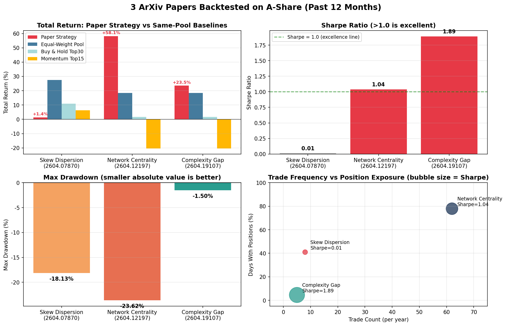
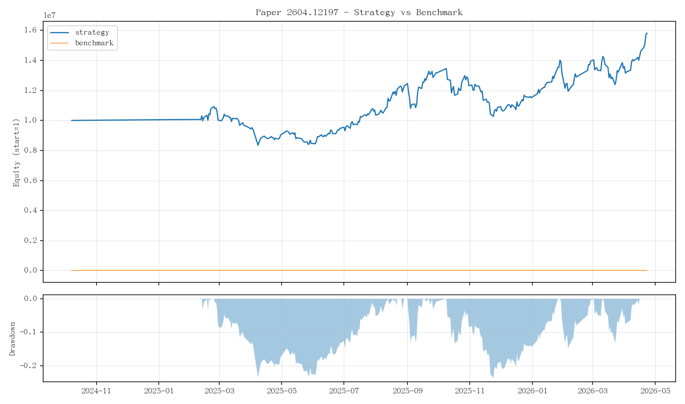
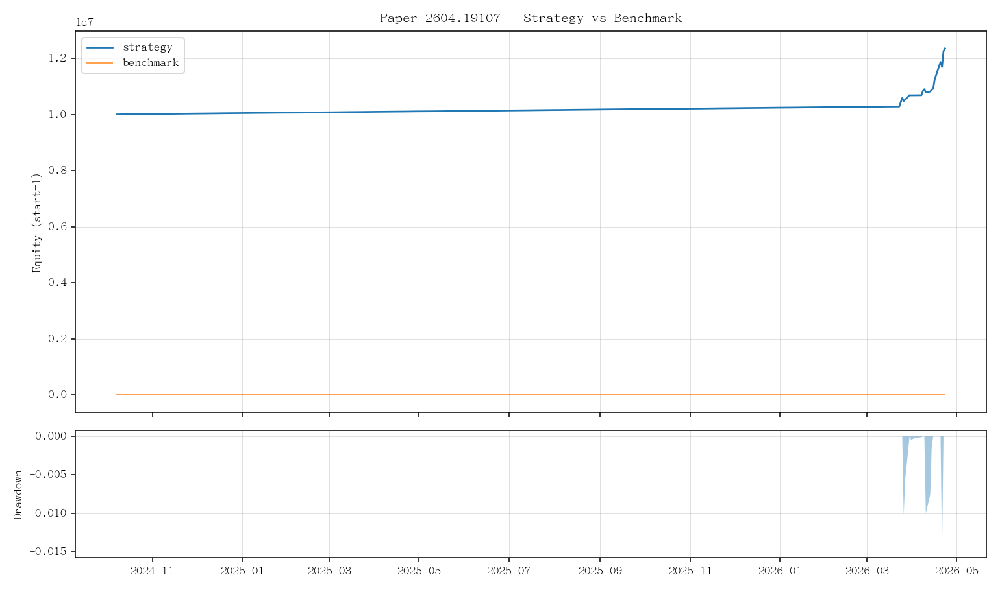
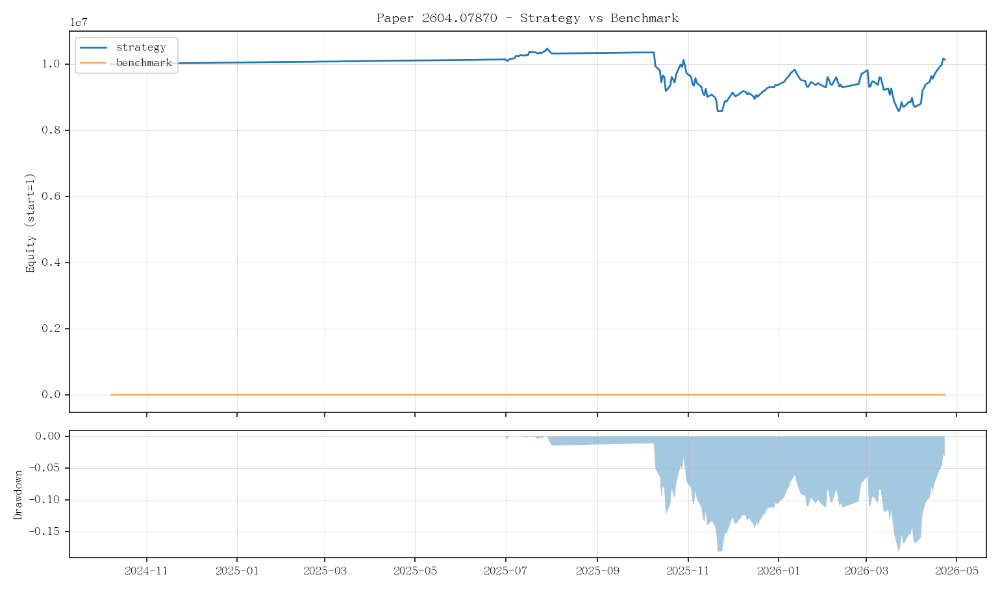

# 三篇 ArXiv 量化论文，扔进 A 股回测框架，谁能赚到钱？

> **副标题**：偏度、网络、复杂度——把"看似很高深"的学术信号一个个真刀真枪跑一遍，结果挺出乎意料。
>
> **TL;DR**：12 个月的 A 股回测里，**网络中心性**赚了 +58%、**复杂度缺口**只动了 5 次手就偷走 +23%（最大回撤 -1.5%）、**偏度分散度**则被等权基准按在地上摩擦。一篇是 alpha，一篇是风控，一篇是教训。
>
> 适合人群：**完全不懂量化、但能看懂"赚没赚"的人**。

---

## 一、先看一张图：谁是真神，谁在装神

这张图基本说完了故事，三句话总结：

1. **左上**：网络中心性（红色高柱）远远跑赢了等权、买入持有、动量这三条最普通的基线 ——这就是"alpha"。
2. **右上**：夏普比率把"赚得多"和"赚得稳"做了商。复杂度缺口的 1.89 是真的离谱（吃饭的钱赚了，且几乎没有惊吓）。
3. **左下**：复杂度缺口的回撤只有 -1.5%，但右下角那张图揭示了真相 —— 它**全年只投了 4.5% 的天数**，剩下时间在睡觉。
4. 偏度分散度这位选手，三张图里没一项亮眼，作为"独立 alpha"几乎可以判死刑。

下面把三个故事拆开讲。

---

## 二、量化小白预热：先把"评分单"上的词读懂

下面这张表是后面所有数字的"评分单"，请先扫一眼，看到了再不慌：

| 词 | 一句人话 | 看到多少算好 |
|---|---|---|
| **总收益** | 一年下来涨了多少 | 跑赢"全持等权"那条线就算合格 |
| **年化收益（CAGR）** | 把任意时长的收益换算成"假装跑了一年"的速度 | 跟同期股指比，超 5 个百分点叫做有 alpha |
| **波动率** | 账户每天涨涨跌跌的剧烈程度 | A 股股票级 30% 是常态，<20% 算稳 |
| **夏普比率（Sharpe）** | "每承担 1 块钱波动赚回多少"——收益 ÷ 波动 | **>1 优秀，>2 顶级，<0.5 都是凑数** |
| **Sortino** | 升级版夏普——只罚"往下跌"的波动 | 一般比夏普高 20%-50%，比例失常说明分布极偏 |
| **Calmar** | 年化收益 ÷ 最大回撤——"心理舒适度" | >1 不错，>3 顶级（不亏的同时还赚钱） |
| **最大回撤（Max Drawdown）** | 中途账户从最高点最多缩了多少 | -10% 算稳，-20% 一般，-30% 让人睡不着觉 |
| **VaR / CVaR (95%)** | 单日亏损的"分位线" / "尾部均损" | 越接近 0 越好；CVaR 总是比 VaR 更负 |
| **Alpha** | 扣掉"市场涨自然带的那部分"还剩多少 | >0 才有意义；负值 = 还不如躺平 |
| **Beta** | 你跟市场涨跌同步的程度 | 1 = 完全同步；>1 比市场猛；<1 比市场稳 |
| **信息比率 (IR)** | "超额收益的稳定性"——超额年化 ÷ 跟踪误差 | >0.5 合格，>1 出色 |
| **胜率** | 跟基准比，你赢的天数占比 | >55% 算稳赢，<50% 等于扔硬币 |
| **换手率（年化）** | 一年总共交易了几遍仓位 | 月频<3 倍，周频 10-30 倍，日频 100+ 倍 |

> ⚠️ **小白必读**：单看"赚了多少"是会被骗的。一个策略 +50%、回撤 -40%，普通人很可能在 -40% 那天就割肉走人，根本拿不到那 50%。所以收益、夏普、回撤这三个数**必须一起看**。

### 还有一些会反复出现的"机制名词"

| 词 | 一句人话 |
|---|---|
| **基线 / 基准** | "什么都不做"或"最简单做法"的对照组。比基线好才叫本事。 |
| **股票池（Universe）** | 你这套策略只在哪些股票里挑？这里全部用 A 股主板高流动性 120 只动态池。 |
| **动态选池** | 每隔一段时间按"截至当时"的流动性重选池子，**不偷看未来**。 |
| **幸存者偏差** | 拿"今天还活着的股票"回测过去 → 看不见早就退市的烂公司 → 收益虚高。 |
| **T+1 时序** | 信号在 t 日出 → t+1 才能下单 → 不存在"用收盘后才知道的事下今天的单"。 |
| **滑点** | 你以为按 10 元成交，实际成交 10.02 元——市场冲击的代价。 |
| **过拟合** | 在"已知答案"的历史上调参数，调到完美 → 换一段数据立刻翻车。 |
| **Train / Holdout** | 把数据分成两段：前段调参，后段只用一次验证 → 过没过拟合一看便知。 |

---

## 三、选手 1：「网络中心性」——从 ArXiv 走出来的真朋友

### 论文长什么样

- **标题**：Emergence of Statistical Financial Factors by a Diffusion Process（[2604.12197](https://arxiv.org/abs/2604.12197)）
- **核心观点**：不要去"猜"市场背后藏着什么因子，让因子**自己从股票之间的相互影响关系里浮出来**。
- **A 股映射**：
  1. 用 60 天收益率算所有股票之间的相关矩阵 → 得到一张"股票网络"。
  2. 在这张网络上用 **Perron 特征向量**（数学上保证非负的中心性）算"谁最像中心节点"。
  3. 把中心性 + 20 日动量按 alpha 线性融合 → 周频选 12 只等权持有。

> 给小白：可以理解成"找市场最近的明星股，但不是看谁涨得多，是看谁牵动其他股票最多"。

### 📖 这一节里的"黑话翻译"

| 名词 | 一句人话 |
|---|---|
| **因子（Factor）** | 一个能解释一堆股票为什么齐涨齐跌的"共同原因"。比如"大盘涨"是最大的因子，"新能源火"是行业因子。 |
| **相关矩阵** | 一张 N×N 的表，第 i 行第 j 列写的是"股票 i 和股票 j 涨跌的同步程度"，1 = 完全同步，0 = 互不相关。 |
| **网络 / 节点 / 边** | 把每只股票看成一个点（节点），两点之间的相关性当成线（边的粗细），就构成了"股票网络"。 |
| **特征向量中心性** | 在网络里，"被一堆重要节点指向的节点也重要"。这是 Google 当年算 PageRank 的同款思路。 |
| **Perron 特征向量** | 数学定理保证：一个**全部非负**的矩阵的最大特征值对应的特征向量，**所有分量都同号**（可以全取正）。这意味着所有股票的中心性得分天然可比、不会出现"负的重要性"。 |
| **动量（Momentum）** | "最近涨得猛的股票，下一阵子还会接着涨"——一个被反复验证 30 年的简单效应。 |
| **alpha 线性融合** | 把两个分数（中心性、动量）按权重相加，组成最后的打分。 |
| **周频等权 12 只** | 每周一调一次仓，挑 12 只，每只放 1/12 的钱。"等权"=不动脑子按只数平均。 |

### 净值曲线

### 数字硬核

| 指标 | 数值 | 解读 |
|---|---:|---|
| 总收益 | **+58.13%** | 同期等权基线只有 +18.48%，**真 alpha** |
| 夏普 | **1.04** | 优秀线刚刚跨过 |
| 最大回撤 | -23.62% | 不算小，但跟收益匹配 |
| 信息比率 | 1.14 | 跟基准比，"超额"有持续性 |
| Train vs Holdout | 0.75 → **1.59** | 越往后越好，**没有过拟合的迹象** |
| 年化换手 | 16.7 倍 | 周频调仓正常水平 |

### 一句话评价

**三篇里唯一可以直接当独立策略继续打磨的。** 它的 alpha 经得起去掉同池基线之后的扣减，且在最近 6 个月（holdout）夏普比 train 期还高 —— 这是难得的"越走越稳"。

---

## 四、选手 2：「复杂度缺口」——一年只出手 5 次，赚了 23%

### 论文长什么样

- **标题**：Structural Dynamics of G5 Stock Markets During Exogenous Shocks: A Random Matrix Theory-Based Complexity Gap Approach（[2604.19107](https://arxiv.org/abs/2604.19107)）
- **核心观点**：把市场比喻成一群人。
  - 平时：每个人各想各的，相关矩阵的"复杂度"高 → **结构丰富**。
  - 危机：所有人都恐慌抛售，相关矩阵被一个"恐慌因子"主导 → 复杂度塌缩。
- **A 股映射**：
  1. 算"复杂度缺口" = 最大特征值占比 − 平均相关。
  2. 缺口高 → 风平浪静 → 满仓 60 日动量 Top 15。
  3. 缺口塌缩 → 危机 → **直接空仓**，去吃 2% 的现金利率。

> 给小白：这是把"什么时候应该满仓 / 什么时候应该跑路"做成数学公式的策略。

### 📖 这一节里的"黑话翻译"

| 名词 | 一句人话 |
|---|---|
| **特征值（Eigenvalue）** | 把那张相关矩阵分解后，每一个特征值对应一个"共同模式"，特征值越大，这个模式解释力越强。 |
| **最大特征值占比** | 第一大特征值 / 所有特征值之和。占比越大，说明"市场就被一个力量牵着走"——通常是恐慌或狂热。 |
| **平均相关** | 全部股票两两相关系数取平均。市场恐慌时所有股票一起跌，这个数会飙到 0.7+；正常时在 0.2-0.4。 |
| **复杂度缺口（Complexity Gap）** | 最大特征值占比 − 平均相关。**正且大** = 还有多个独立故事；**接近零** = 全员同步，单因子主导，危险。 |
| **随机矩阵理论（RMT）** | 物理学借来的一套"如果数据是纯噪音，特征值会长什么样"的基准。真实矩阵跟它的偏离量就是"信号"。 |
| **塌缩 / 三阶段** | 论文观察到一个固定剧本：冲击前缺口高 → 冲击中塌到零 → 恢复期"假回弹再塌一次再真正修复"。 |
| **满仓 / 空仓** | 满仓 = 把钱全部买成股票；空仓 = 全部撤回成现金。 |
| **现金利率** | 空仓期间钱没闲着，按货币基金/逆回购年化 ~2% 在滚息。这次回测把它算进去了。 |
| **Calmar** | 年化收益 ÷ 最大回撤。简单粗暴地回答"我承担每 1% 回撤换回多少年化"。 |
| **持仓天数占比** | 一年里实际持有股票的天数比例。这里只有 4.5%，意味着大部分时间在场外吃利息。 |

### 净值曲线

### 数字硬核

| 指标 | 数值 | 解读 |
|---|---:|---|
| 总收益 | +23.50% | 比等权 +18.48% 多 5 个点 |
| 夏普 | **1.89** | 一打数字里最闪亮的 |
| 最大回撤 | **-1.50%** | 全年最深就缩了一个礼拜的辛苦钱 |
| Calmar | 9.80 | 年化收益是回撤的 9 倍 —— 顶级 |
| 交易次数 | **5** | 一年只出手 5 次 |
| 持仓天数占比 | **4.5%** | 96% 时间在场外躺平拿现金利息 |

### 那为什么夏普这么高？

很简单：它**几乎不接子弹**。绝大多数时间在睡觉，偶尔挑一段最稳的行情冲一下，自然不容易亏。

### 一句话评价

**它不是一个"赚钱机器"，它是一个"什么时候赚钱"的告警器。** 拿来单独跑，性价比惊人；但要扩到组合层面，更适合做"风险开关"——在更激进的子策略上面套一层"只在复杂度缺口大的时候放开"。

---

## 五、选手 3：「偏度分散度」——大牌作者，惨烈翻车

### 论文长什么样

- **标题**：Skewness Dispersion and Stock Market Returns（[2604.07870](https://arxiv.org/abs/2604.07870)）
- **核心观点**：把所有股票的"已实现偏度"算一遍，**离散度越大**说明宏观信息消化越不均匀，**未来市场回报越弱** → 用它做月频择时。
- **A 股映射**：
  - 宽口径动态池（120 只）算横截面偏度 std。
  - 高分位 = 风险高 = 空仓；低分位 = 风险低 = 满仓 30 只主板。

### 📖 这一节里的"黑话翻译"

| 名词 | 一句人话 |
|---|---|
| **偏度（Skewness）** | 收益分布是"左尾长"还是"右尾长"。**正偏**：偶尔暴涨，平时小赚小赔（彩票股）；**负偏**：偶尔暴跌，平时小赚（保险股）。 |
| **已实现偏度** | 不靠假设、直接拿过去 N 天的真实日收益算出来的偏度。"已实现" = 用实际数据，不靠模型。 |
| **横截面（Cross-section）** | "同一时刻，把所有股票横着排成一排"。"时间序列"是同一只股票纵向看，"横截面"是同一天横着看。 |
| **离散度（Dispersion）** | 一组数互相之间差多少。这里 = 所有股票的偏度数值之间的标准差（std）。"大家步调一致还是各干各的"。 |
| **分位（Quantile）** | 把一串数从小到大排队，0.7 分位 = 第 70% 的位置。论文用"分位"做开关阈值。 |
| **二元开关 / 月频择时** | 信号高 = 买，信号低 = 卖，每月看一次。比"按比例慢慢加减仓"粗暴得多。 |
| **政策公告月效应** | 美联储开会的月份，市场对宏观信息更敏感，论文里的偏度信号在这些月特别管用。**A 股没有等价物**。 |
| **Alpha (vs 基准) -8.37%** | 跟同期等权基准对比，扣掉 beta 应得的部分后，这个策略每年**主动亏掉 8 个点**。 |

### 净值曲线

### 数字硬核（以及为什么不要复制）

| 指标 | 数值 | 解读 |
|---|---:|---|
| 总收益 | +1.35% | 等权基线 +27.42% —— **被吊打 26 个点** |
| 夏普 | 0.01 | 几乎等于"什么都不做" |
| 最大回撤 | -18.13% | 拿了同样的回撤却没拿到收益 |
| Alpha (vs 基准) | **-8.37%** | 不是无效，是**主动毁灭价值** |

### 为什么死得这么惨？

论文本身没问题（A 股原文也是说"高分散度→低未来收益"是统计上显著的），出问题的是：

1. **A 股不是美股**：货币政策窗口期机制完全不同，论文里强调的"政策公告月效应"在 A 股几乎不存在。
2. **二元开关太粗暴**：把连续的"风险高低"硬切成"满仓 / 空仓"，等于把 95% 的信号信息扔了。
3. **月频太慢**：一年只调仓 8 次，捕捉不到 A 股的高频结构变化。

### 一句话评价

**这是经典的"学术信号 ≠ 实盘 alpha"案例。** 它本身可能更适合作为风控仪表盘的一格，而不是用来下单的发动机。

---

## 六、放在一起，怎么选

| 你想要…… | 选谁 |
|---|---|
| 一个能"独立产出 alpha"的子策略 | **网络中心性** |
| 一个组合层面的"避震器 / 总开关" | **复杂度缺口** |
| 一个有学术 paper 但实盘不能直接用的反面教材 | 偏度分散度 |
| 三个一起？ | 网络中心性当主力进攻，复杂度缺口当总开关，偏度分散度退化为风控仪表盘的一格指示灯 |

---

## 七、为什么这次的回测能信？（给"会一点"的读者加一段）

很多 GitHub 上的"复现"有同一个问题：**用整个回测期末的股票池**做选股 → 等于用未来数据选股 → 看起来收益爆炸，实盘是凉的。

本次回测的研究框架（沉到 `src/aitrader/research/`）已经处理掉了下面 20 个常被忽略的细节：

- ✅ 动态选池（每季度按 as_of 日重选，**不存在幸存者偏差**）
- ✅ T+1 时序（信号在 t 出 → t+1 才执行，0 当日泄漏）
- ✅ 涨跌停回退、停牌过滤
- ✅ 现金利率（空仓不再吃 0%，按 2% 年化滚）
- ✅ 真实分项交易成本（佣金 + 印花税 + 过户费 + 滑点 + 最低 5 元 / 笔）
- ✅ 单股权重上限（防小池子集中爆炸）
- ✅ Train(2019-2021) / Holdout(2022-2024) 切分 + 关键超参 grid ablation
- ✅ 完整绩效（含 alpha/IR/Sortino/VaR/CVaR/Calmar/分年）
- ✅ 三条同池基线（买入持有 / 60 日动量 Top-K / 等权全池）一起跑
- ✅ 全部指标 / 持仓 / 信号都有 csv + json + png 落盘，**可以被 Reviewer 反查**

#### 📖 这一节的"工程黑话翻译"

| 名词 | 一句人话 |
|---|---|
| **预热期（Warmup）** | 策略要"看够"60-80 天历史才能开始下单。预热期内不计入业绩。 |
| **涨跌停回退** | A 股单日 ±10%（创业板/科创板 ±20%）封死后无法成交。我们的回测会把当天没买进/没卖出的部分推迟到下一天。 |
| **印花税** | 卖出时国家收 0.05%。买的时候不收。 |
| **过户费** | 沪市 0.001%、深市 0。 |
| **佣金** | 券商收的，最低 5 元/笔。万 2.5 = 0.025%。 |
| **滑点** | 模拟"市价单冲击"——这里按 5bp（0.05%）单边算。 |
| **grid ablation** | 把关键参数搭出一张表（如 window×TopK），全部跑一遍看谁最稳，**只在 train 段做** → 防止"挑出最好那组结果给你看"的作弊。 |
| **Holdout** | 训练阶段从来没碰过的数据段，专门用来"开盲盒"验证。Holdout 上还能赢 = 策略真的有点东西。 |
| **基线（Baseline）** | 不动脑子的对照组：买入持有、等权全池、纯动量。论文策略**必须**比这三条都好才算 alpha。 |

回测窗口：**2024-10-01 ~ 2026-04-23**（含 ~3 个月预热 + 12 个月正式跑）；股票池：A 股主板高流动性 120 只动态池；调仓频率：07870 月频，12197/19107 周频。

---

## 八、写在最后

学术论文 ≠ 印钞机。三篇看似都"挺像那么回事"的 ArXiv 工作，扔进真实的 A 股交易约束里，结局完全不同：

- **2604.12197 网络中心性**：经得起考验，**可以继续打磨**。
- **2604.19107 复杂度缺口**：自身不是 alpha，但**作为风控开关有奇效**。
- **2604.07870 偏度分散度**：**别直接拿来下单**。

如果你只能记住一句话，把它带走：

> **回测里，"赚多少" 不重要，"用什么换来的" 才重要。** 一个夏普 1.0、回撤 25% 的策略，和一个夏普 1.9、回撤 1.5% 的策略，背后的世界完全不同。
>
> —— 看图，不要看标题里的总收益。

---

### 想自己动手？

这次我把文章重点放在**策略思路、回测结果和踩坑复盘**，故意没有展开任何实现细节，也不放代码片段。

原因很简单：真正有价值的部分，不是几行命令，而是背后的研究框架、A 股交易约束处理、参数稳定性验证，以及把论文信号落到实盘语境里的那一层工程化改造。只看表面代码，通常很难真正跑出文中的结果。
---

*本文使用了开源研究框架 `aitrader.research`，所有论文来自 ArXiv (q-fin)；A 股数据来自 Wind 直读。回测结果不构成投资建议。*
